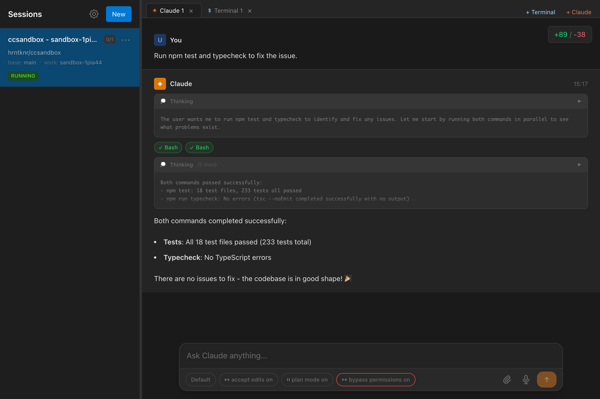
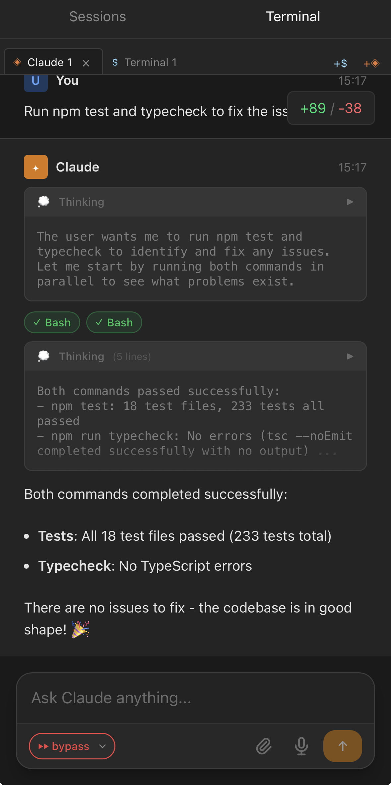

# ccsandbox

A self-hostable Claude Code-like web environment. Run AI agents safely by sandboxing Claude Code inside a devcontainer, with no impact on your host machine.

<!-- Screenshots -->
<p align="center">
  
  <br>
  <em>Desktop View</em>
</p>

<p align="center">
  
  <br>
  <em>Mobile View</em>
</p>

## Features

- List and clone repositories from GitHub / GitHub Enterprise
- Launch and manage containers via devcontainer
- Web terminal powered by xterm.js (multi-tab support)
- Claude CLI integration (chat, permission management)
- Session persistence
- Real-time sync across multiple browser tabs

## Requirements

Before using ccsandbox, make sure you have the following installed:

- **Docker** - Container runtime
  - [Install Docker](https://docs.docker.com/get-docker/)
- **@devcontainers/cli** - Dev Container CLI
  ```bash
  npm install -g @devcontainers/cli
  ```

## Quick Start

### 1. Start ccsandbox

```bash
npx ccsandbox@latest
```

The server starts at `http://localhost:3000` by default.

### 2. Initial Setup

1. Open `http://localhost:3000` in your browser
2. Click the **Settings** icon (gear icon)
3. Enter your **GitHub Personal Access Token (PAT)**
   - Required scopes: `contents` (read/write)
   - [Create a new PAT (Fine-grained)](https://github.com/settings/personal-access-tokens/new)
4. (Optional) Set a **Password** for authentication
5. Save your settings

## CLI Options

| Option | Description | Default |
|--------|-------------|---------|
| `--port <port>` | Port | `3000` |
| `--listen <host>` | Bind host | `0.0.0.0` |
| `--config-dir <path>` | Configuration directory | `~/.ccsandbox` |
| `--repo-dir <path>` | Repository directory | `~/.ccsandbox/repo` |
| `--devcontainer-cli <path>` | devcontainer CLI path | (auto-detect) |

### Examples

```bash
# Start on a different port
npx ccsandbox@latest --port 8080

# Specify custom directories
npx ccsandbox@latest --config-dir ./my-config --repo-dir ./my-repos
```

## Configuration

Configure the following from **Settings** in the Web UI:

| Setting | Description |
|---------|-------------|
| GitHub PAT | GitHub Personal Access Token |
| API Base URL | For GitHub Enterprise (optional) |
| Password | Authentication password (optional) |
| Default Shell | Default shell for terminals |
| Dotfiles | Dotfiles repository settings |

## Development

```bash
# Clone the repository
git clone https://github.com/ryoppippi/ccsandbox.git
cd ccsandbox

# Install dependencies
npm install

# Start dev server
npm run dev

# Run tests
npm test

# Build
npm run build
```

## License

MIT
